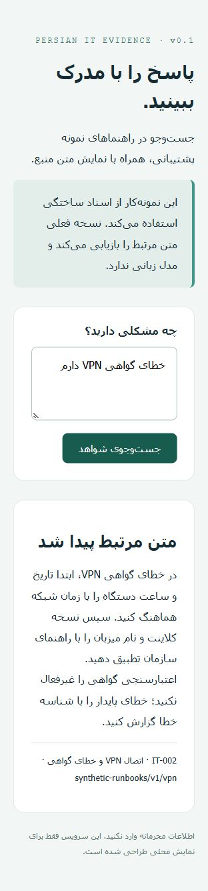

# Persian IT Evidence

A Persian-aware, source-linked search assistant for IT support runbooks. Built as an **AI-assisted independent portfolio project**, connecting practical IT operations with retrieval engineering and evaluation.

**Status: v0.1, working local baseline.** This release uses BM25 lexical retrieval and returns verbatim source excerpts. It does **not** use an LLM, embeddings, or a production RAG pipeline. Documents and evaluation questions are synthetic; no customer deployment is claimed.



## Why this project

An IT support answer should be traceable to an approved document. This project starts with a measurable retrieval baseline before adding semantic search or generation. The interesting engineering questions are whether the right source is found, whether unsupported questions are rejected, and whether restricted documents stay out of public results.

## Run in two minutes

Requires Python 3.11 or newer. No package installation, API key, model download, or paid service is needed.

```sh
python server.py
# Open http://127.0.0.1:8765
```

CLI:

```sh
python evidence.py "خطای گواهی VPN دارم"
python -m unittest discover -s tests -v
python evaluate.py --check
```

The server binds to loopback only. The optional CLI `--scope staff` demonstrates trusted application access; it is not an authentication mechanism. The HTTP endpoint always uses public scope and rejects extra fields such as `scope`.

API example:

```sh
curl http://127.0.0.1:8765/api/ask -H "Content-Type: application/json" -d '{"question":"VPN certificate clock"}'
```

Response includes `status`, `answer`, `citations`, and `retrieved`. `evidence_found` means a lexical relevance heuristic passed, not that a human-quality answer was verified.

## Measured results — 7 October 2026

| Check | Observed result |
|---|---:|
| Unit and local HTTP integration tests | 18 passed |
| Synthetic evaluation questions | 24 |
| Answerable / unanswerable questions | 18 / 6 |
| Recall@3 on answerable questions | 16/18 = 88.9% |
| MRR@3 on answerable questions | 0.889 |
| Correct cited source or abstention | 22/24 = 91.7% |
| Abstention on unanswerable questions | 6/6 |
| Restricted documents in public results | 0 in this evaluation |

These are **small, author-written smoke tests**, not independent held-out evaluation or evidence of production accuracy. Both datasets were authored together. The fixed coverage threshold was present before the first run; no test questions were removed after seeing failures. Lexical overlap and manually written English tags make this dataset easier than real support traffic. English-tag matches are not general cross-language semantic understanding.

Read the [complete result data](reports/evaluation.json) and [failure analysis](reports/FAILURE_ANALYSIS.md). Local tests passed on Windows. The same tests and evaluation also passed on GitHub's Ubuntu runner: [verified CI run](https://github.com/saintedwind/persian-it-evidence/actions/runs/37599503259).

## Architecture

```text
Persian web UI / CLI
        |
HTTP input validation (public scope only)
        |
Scope filtering BEFORE corpus statistics and ranking
        |
Persian normalization -> tokenization -> BM25
        |
Coverage heuristic -> source excerpt or abstention
```

- Arabic/Persian character normalization and zero-width space handling.
- Deterministic ranking with stable document-ID tie-breaking.
- Source identifiers and exact evidence excerpts.
- Public/staff filtering before scoring; public responses never contain restricted excerpts.
- Tests exercise HTTP behavior, caller-supplied scope rejection, normalization, source fidelity, and file-path isolation.
- Browser renders text with `textContent`; generated source strings are never interpreted as HTML.
- No remote requests, query storage, or real secrets are needed for this demo.

## Limitations and next experiments

1. Indirect paraphrases fail. Compare a multilingual embedding retriever against this frozen baseline using a separate new evaluation set.
2. Lexical coverage is not entailment. A question that contains topic words can retrieve a related but non-answering passage. Abstention is not calibrated.
3. There is no instruction-following model, so this version cannot establish LLM prompt-injection resistance.
4. Scope filtering is not enterprise authorization. Production needs authenticated identities, audited ingestion, document ownership, and enforced authorization at every route.
5. Rebuilding counts per request is intentionally simple for 13 documents; this has not been load-tested at scale.
6. Python's standard-library HTTP server is for local demonstration only. Do not expose it to the Internet.
7. Documents are manually authored synthetic examples; no ingestion pipeline, OCR, document versioning, or feedback persistence exists yet.

See [ROADMAP.md](ROADMAP.md) for release gates. Each new claim must point to a reproducible artifact. No employer data should enter this repository without permission and redaction.

## Data and authorship

All 13 runbooks (12 public, 1 restricted) and all 24 questions were created for this project. They are not company procedures or security guidance for any real environment. Code, tests, documentation, and initial evaluation were developed with AI assistance. The portfolio owner should be able to explain, modify, and reproduce them before presenting the work in an interview.

Project owner: Peyman Gholamhosseini. No employment, client adoption, cost reduction, or real-world accuracy claim is implied.

## راهنمای فارسی

این نسخه، نقطه شروع قابل اجرا و قابل اندازه‌گیری است. پرسش را وارد کنید تا متن راهنمای مرتبط همراه شناسه منبع نمایش داده شود. اگر پوشش واژگانی کافی نباشد، برنامه اعلام می‌کند شواهد کافی ندارد. دو شکست ثبت‌شده مربوط به پرسش‌هایی هستند که مفهوم را با واژگان متفاوت بیان می‌کنند. مرحله بعد، آزمایش جست‌وجوی معنایی روی یک مجموعه ارزیابی جداگانه است.
